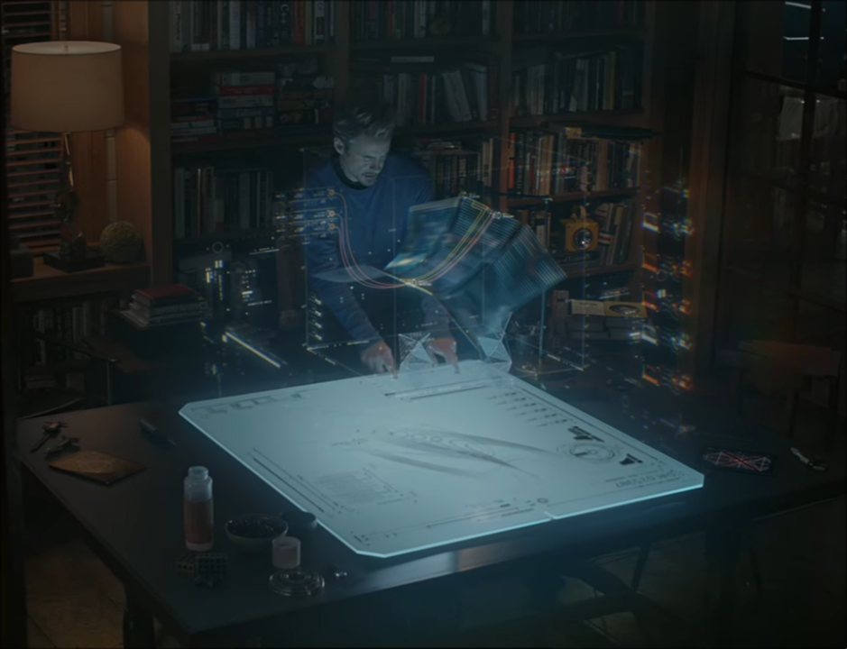

# <span class="blue">gum.jsx</span> — a graphical language for humans and LLMs

<div class="buttons">
<a class="button" href="https://github.com/CompendiumLabs/gum.jsx" target="_blank">GitHub</a>
<a class="button" href="https://compendiumlabs.ai/gum/editor" target="_blank">Demo</a>
<a class="button" href="https://compendiumlabs.ai/gum/docs" target="_blank">Docs</a>
</div>

We're gonna build `J.A.R.V.I.S.`. We gotta build `J.A.R.V.I.S.`. Karpathy agrees [1]. Tony Stark agrees. What could possibly go wrong? We gotta build `J.A.R.V.I.S.`.

<p></p>

Let's consider what Tony is working with here. In addition to the intelligent voice assistant with a sophisticated British accent (achievement already unlocked), there is a rich visual interface providing information to the user. Whether this is part of some internally constructed program or generated on-the-fly is not specified, but it is visually stunning (moreso with each subsequent installment).

But it's still only 2026. We don't have the slick hologram display, and getting LLMs to generate those kinds of visuals in real time would be a stretch. It's worth looking at what's possible with today's technology though. So let's scale back our ambitions (a lot) and focus on 2D non-interactive graphics.

A natural choice for this domain is SVG. It's a a text-based vector format with great web support, so you can plop it down most anywhere you want and expect it to work. But it's wordy, or number-y. If you look at actual SVG files, it's usually just a big list of numbers punctuated by the occasional XML tag. No ideal for humans or LLMs.

So it's a codegen problem, but SVG is way too low-level as a language. We need to go higher. There are already lots of options out there (this is a non-exhaustive list, and do let me know if there's something obviously missing):

| Name                                 | Domain             | Language   |
|--------------------------------------|--------------------|------------|
| [Mermaid](https://mermaid.js.org/)   | Flowcharts         | Markdown   |
| [Vega](https://vega.github.io/vega/) | Data Visualization | JSON       |
| [Chart.js](https://www.chartjs.org/) | Charts             | Javascript |
| [Three.js](https://threejs.org/)     | 3D Graphics        | Javascript |
| [D3](https://d3js.org/)              | Data Visualization | Javascript |

I would say that `D3` strikes the best balance between expressiveness and elegance. It's actually really impressive, but I often feel like I'm not smart enough to use it effectively, and I worry that LLMs might not be either. So I decided to make my own language called <span class="blue bold">gum.jsx</span>, which is why we're here.

As the name suggests, it's a JSX dialect that is very React-like. The core library is a set of components for laying out and styling graphics. There are a number of built-in components for common use cases like plots, bar charts, network diagrams, etc. <span class="italic">(Click on any of the non-interactive examples here to toggle between the image and the code that generated it.)</span>

```gum size=600
const decay = x => exp(-x/2) * sin(3*x)
return <Plot xlim={[0, 2*pi]} ylim={[-1, 1]} grid margin={0.1} aspect={2}>
  <SymLine fy={decay} N={200} opacity={0.25} />
  <SymSpline fy={decay} N={10} stroke={blue} stroke-width={2} />
  <SymPoints fy={decay} N={10} size={0.05} fill={red} />
</Plot>
```

This guy was only 6 lines of code. There's minimal boilerplate and every little argument has its own purpose. That example is particular to the (very common) use case of making plotting a function, but it's actually much more general. Here's a more abstract object I have come to quite enjoy (codename <span class="italic">Shai Hulud</span>):

```gum size=600
<Graph ylim={[-1.5, 1.5]} padding={0.15} aspect={2}>
  <SymPoints
    fy={sin} xlim={[0, 2*pi]} size={0.5} N={100}
    shape={x => <Square rounded spin={r2d*x} />}
  />
</Graph>
```

If you toggle in on the code, you'll that both of these examples employ symbolic/functional approaches to generating graphics. That's cool, and even really useful, but let's look into the fundamentals of the framework itself.

## Building Blocks

<span class="blue bold">gum.jsx</span> is built around a set of modular components (derived from `Element`). The most important properties of an `Element` are its aspect ratio (`aspect`) and its placement rectangle (`rect`). Container classes (derived from `Group`) house child elements. These are placed within their specified rectangle while respecting their aspect ratio.

For example, here's what happens when we place a square (a `Rectangle` element with `aspect=1`) inside a 0.8 x 0.4 rectangle around the center of the canvas.

```gum size=500
<Box margin={0.06} aspect={1.5}>
  <Group>
    <Rectangle stroke-dasharray={5} />
    <BoxLabel side="top" size={0.075} align="left">SVG</BoxLabel>
  </Group>
  <Group rad={[0.4, 0.2]}>
    <Rectangle stroke={blue} stroke-dasharray={5} />
    <BoxLabel color={blue} side="top" size={0.15} align="left">RECT</BoxLabel>
  </Group>
  <Group rad={[0.4, 0.2]}>
    <Square stroke={red} />
    <BoxLabel color={red} side="top" size={0.15} align="center">SQUARE</BoxLabel>
  </Group>
</Box>
```

Layout components like `Box` and `Stack` will take into account the aspect ratios of their children and position them accordingly, giving the parent element the resulting combined aspect ratio. This gives you a lot of the functionality of CSS's flexbox model, but with more control over precise positioning.
